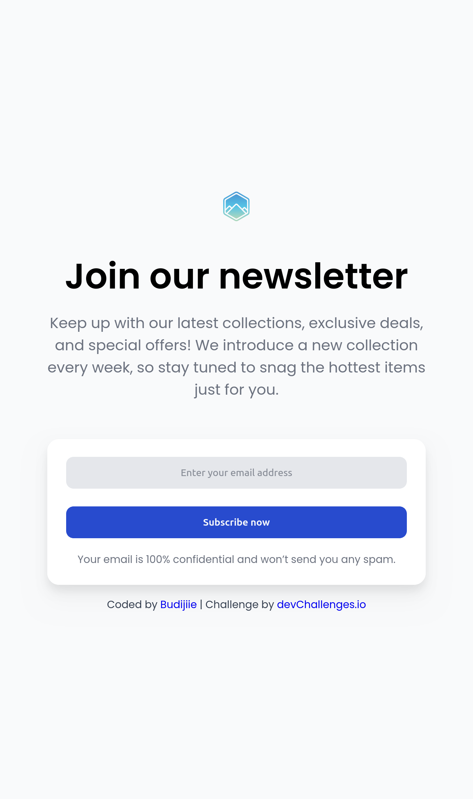

<!-- Please update value in the {}  -->

<h1 align="center">{Join Our Newsletter} | devChallenges</h1>

   Solution for a challenge <a href="https://devchallenges.io/challenge/join-our-newsletter" target="_blank">Join Our Newsletter</a> from <a href="http://devchallenges.io" target="_blank">devChallenges.io</a>.

  <h3>
    <a href="{https://budijiie.github.io/join-our-newsletter-master/}">
      Demo
    </a>
     | 
    <a href="{https://devchallenges.io/solution/55473olution}">
      Solution
    </a>
     | 
    <a href="https://devchallenges.io/challenge/join-our-newsletter">
      Challenge
    </a>
  </h3>

<!-- TABLE OF CONTENTS -->

## Table of Contents

- [Overview](#overview)
  - [What I learned](#what-i-learned)
- [Built with](#built-with)
- [Features](#features)
- [Contact](#contact)

<!-- OVERVIEW -->

## Overview

### What I learned

I learn about simplify the width and max-width 
  - width: min(80%, 750px);

### Built with

- Semantic HTML5 markup
- CSS custom properties
- Flexbox

## Features

This application/site was created as a submission to a [DevChallenges](https://devchallenges.io/challenges-dashboard) challenge.

## Author

- GitHub [budijiie](https://{https://github.com/budijiie})
